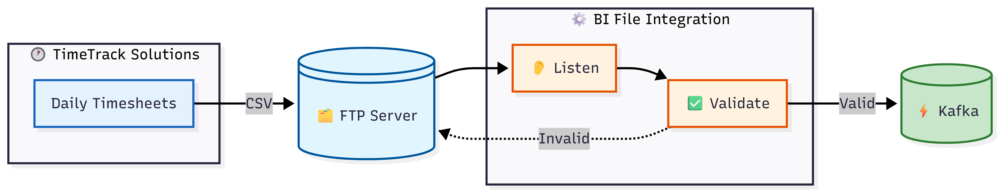

# Contractor Timesheet Validation with File-Level Rejection

## Description

This integration validates and processes daily contractor timesheet files for a construction company. It implements an "all-or-nothing" integrity check - if a file fails validation (record count mismatch or too many invalid contractor IDs), the entire file is quarantined for manual review, preventing corrupt data from entering the payroll system.

Try this in Devant:

[](https://console.devant.dev/new?gh=wso2/integration-samples/tree/main/ballerina-integrator/contractor-timesheet-validation&t=file)


## Architecture Overview

**BuildRight Construction** outsources timesheet collection to **TimeTrack Solutions**, a workforce management vendor. Each day, TimeTrack uploads a CSV file containing hours logged by contractors across job sites in Colombo, Kandy, and Galle. Before processing payroll, the file must pass integrity checks to prevent ghost employees and data corruption.




**Validation Rules:**

| Check | Condition | On Failure |
|-------|-----------|------------|
| Record Count | Must equal expected headcount (150) | Quarantine entire file |
| Contractor ID | Verified against active contractor cache | Track invalid count |
| Error Threshold | Invalid records must be ≤ 5% of total | Quarantine entire file |

**Flow:**

1. **TimeTrack Solutions** uploads daily CSV to `/timesheets/incoming`
2. FTP listener detects new `.csv` file and triggers validation
3. **Validation Gateway** performs integrity checks:
   - Verifies record count matches expected contractor headcount
   - Validates each contractor ID against the active employee cache
   - Calculates error percentage
4. **Valid files**: Records sent to `contractor-payroll` Kafka topic → file moved to `/timesheets/processed`
5. **Invalid files**: File moved to `/timesheets/quarantine` → alert sent to payroll team for manual review


## Prerequisites

- **WSO2 Integrator: BI** - Install from [Visual Studio Marketplace](https://marketplace.visualstudio.com/items?itemName=WSO2.ballerina-integrator)
- **Docker** - For running Kafka and FTP server containers
- **Apache Kafka** - Local or containerized instance
- **FTP Server** - With read/write access to timesheet directories

## Set up the environment

### Set up Kafka

Run the Kafka broker (KRaft mode - no Zookeeper required):

```bash
docker run -d --name kafka-server -p 9092:9092 \
    -e KAFKA_NODE_ID=1 \
    -e KAFKA_PROCESS_ROLES=broker,controller \
    -e KAFKA_LISTENERS=PLAINTEXT://0.0.0.0:9092,CONTROLLER://0.0.0.0:9093 \
    -e KAFKA_ADVERTISED_LISTENERS=PLAINTEXT://localhost:9092 \
    -e KAFKA_CONTROLLER_LISTENER_NAMES=CONTROLLER \
    -e KAFKA_LISTENER_SECURITY_PROTOCOL_MAP=CONTROLLER:PLAINTEXT,PLAINTEXT:PLAINTEXT \
    -e KAFKA_CONTROLLER_QUORUM_VOTERS=1@127.0.0.1:9093 \
    -e KAFKA_OFFSETS_TOPIC_REPLICATION_FACTOR=1 \
    -e CLUSTER_ID=MkU3OEVBNTcwNTJENDM2Qk \
    apache/kafka:4.1.1
```

Create the payroll topic:

```bash
docker exec -it kafka-server /opt/kafka/bin/kafka-topics.sh --create \
  --topic contractor-payroll \
  --bootstrap-server localhost:9092 \
  --partitions 1 \
  --replication-factor 1
```

### Set up FTP server

Run the FTP server container:

```bash
docker run -d --name ftp-timesheets \
  -p 21:21 \
  -e "PUBLICHOST=localhost" \
  -e "FTP_USER_NAME=ftpuser" \
  -e "FTP_USER_PASS=ftppass" \
  -e "FTP_USER_HOME=/home/ftpuser" \
  stilliard/pure-ftpd
```

Create the required directories:

```bash
docker exec ftp-timesheets mkdir -p /home/ftpuser/timesheets/incoming /home/ftpuser/timesheets/processed /home/ftpuser/timesheets/quarantine

# Fix permissions for write access
docker exec ftp-timesheets chmod -R 755 /home/ftpuser/timesheets
```

### Add sample data to the FTP server

Create a test file `timetrack-2024-01-15.csv`. For testing purposes, update the expected record count in `main.bal` from `150` to `5`:

```bash
docker exec ftp-timesheets sh -c "cat > /home/ftpuser/timesheets/incoming/timetrack-2024-01-15.csv << 'EOF'
contractor_id,date,hours_worked,site_code
CTR-001,2024-01-15,8.0,SITE-COLOMBO-HQ
CTR-002,2024-01-15,7.5,SITE-KANDY-MALL
CTR-003,2024-01-15,9.0,SITE-GALLE-RESORT
CTR-004,2024-01-15,8.0,SITE-COLOMBO-HQ
CTR-005,2024-01-15,6.5,SITE-KANDY-MALL
EOF"
```

Create an invalid test file with bad contractor IDs (3 out of 5 = 60% invalid, exceeds 5% threshold):

```bash
docker exec ftp-timesheets sh -c "cat > /home/ftpuser/timesheets/incoming/timetrack-2024-01-16-bad.csv << 'EOF'
contractor_id,date,hours_worked,site_code
CTR-001,2024-01-16,8.0,SITE-COLOMBO-HQ
GHOST-999,2024-01-16,7.5,SITE-KANDY-MALL
FAKE-123,2024-01-16,9.0,SITE-GALLE-RESORT
INVALID-ID,2024-01-16,8.0,SITE-COLOMBO-HQ
CTR-005,2024-01-16,6.5,SITE-KANDY-MALL
EOF"
```

## Running the Integration

### Step 1: Open the Integration Project

1. Open VS Code with WSO2 Integrator: BI installed
2. Click on the BI icon on the sidebar
3. Open the `contractor-timesheet-validation` project

### Step 2: Configure Variables

1. Open the **Configurations** section from the left panel
2. Add values to all configurable fields:

| Field | Value |
|-------|-------|
| `ftpHost` | `localhost` |
| `ftpPort` | `21` |
| `ftpUser` | `ftpuser` |
| `ftpPassword` | `ftppass` |
| `kafkaBootstrapServers` | `localhost:9092` |
| `kafkaTopic` | `contractor-payroll` |

### Step 3: Run the Integration

1. Click the **Run** button in the BI extension
2. Wait for the integration to start (you'll see logs in the output panel)

**Expected Results:**

1. **Valid file** (`timetrack-2024-01-15.csv`):
   - All 5 records pass validation (count matches, all contractor IDs valid)
   - Records sent to Kafka topic `contractor-payroll`
   - File moved to `/timesheets/processed/`

2. **Invalid file** (`timetrack-2024-01-16-bad.csv`):
   - 3 out of 5 records have invalid contractor IDs (60% error rate > 5% threshold)
   - File moved to `/timesheets/quarantine/`
   - No records sent to Kafka

3. Verify Kafka messages:

```bash
docker exec -it kafka-server /opt/kafka/bin/kafka-console-consumer.sh \
  --topic contractor-payroll \
  --bootstrap-server localhost:9092 \
  --from-beginning
```

4. Verify file routing:

```bash
docker exec ftp-timesheets ls /home/ftpuser/timesheets/processed
# Should contain: timetrack-2024-01-15.csv

docker exec ftp-timesheets ls /home/ftpuser/timesheets/quarantine
# Should contain: timetrack-2024-01-16-bad.csv
```

## Deploy on Devant

1. Deploy this integration on **Devant** as a **File Integration**
2. Configure the FTP and Kafka connection parameters with your production values
