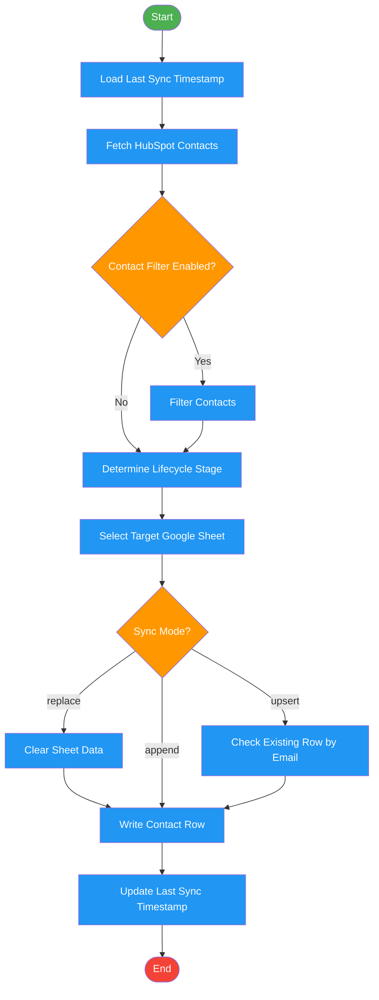

```mermaid
flowchart TD

A([Start]):::startNode
B[Load Last Sync Timestamp]:::processNode
C[Fetch HubSpot Contacts]:::processNode
D{Contact Filter Enabled?}:::decisionNode
E[Filter Contacts]:::processNode
F[Determine Lifecycle Stage]:::processNode
G[Select Target Google Sheet]:::processNode
SM{Sync Mode?}:::decisionNode
REP[Clear Sheet Data]:::processNode
H[Check Existing Row by Email]:::processNode
I[Write Contact Row]:::processNode
J[Update Last Sync Timestamp]:::processNode
K([End]):::endNode

A --> B
B --> C
C --> D
D -->|Yes| E
D -->|No| F
E --> F
F --> G
G --> SM
SM -->|replace| REP
REP --> I
SM -->|append| I
SM -->|upsert| H
H --> I
I --> J
J --> K

classDef startNode fill:#4CAF50,color:#fff
classDef endNode fill:#F44336,color:#fff
classDef processNode fill:#2196F3,color:#fff
classDef decisionNode fill:#FF9800,color:#fff
```