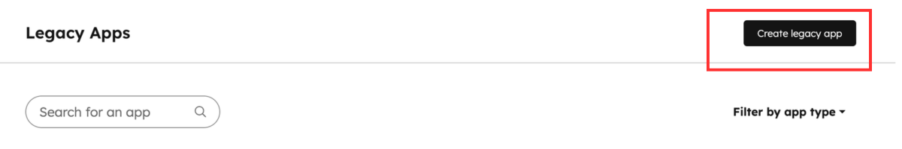
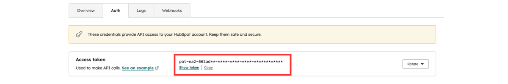
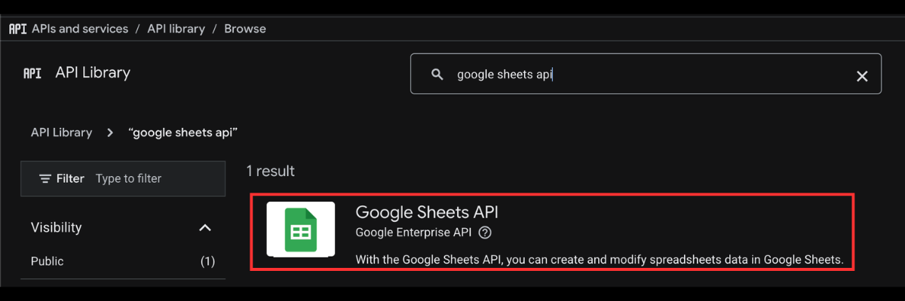
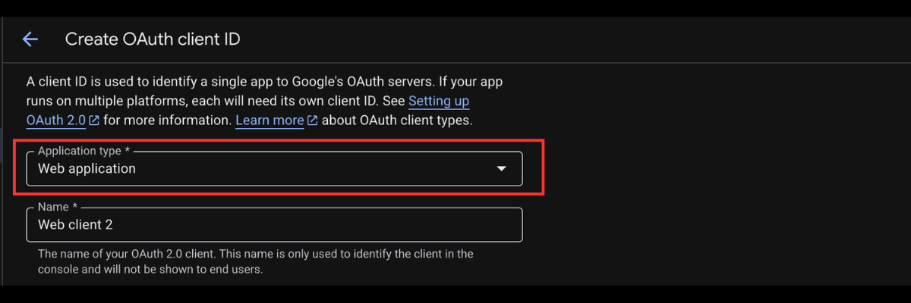
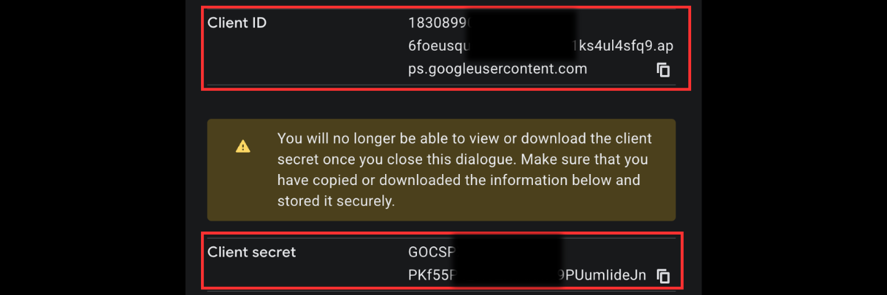
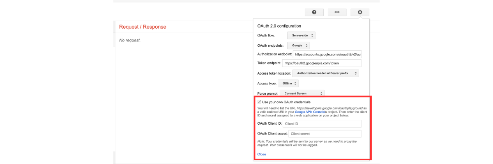

# HubSpot Contacts to Google Sheets

## What It Does

- Fetches contacts from HubSpot using the CRM Contacts API
- Routes contacts to different sheet tabs based on their **lifecycle stage** (Subscriber, Lead, MQL, SQL, Opportunity, Customer, Evangelist, Other)
- Uses **email as a unique key** to upsert rows — no duplicates
- Supports **incremental sync** — only new or modified contacts are processed each run
- Supports **configurable field mapping** between HubSpot properties and spreadsheet columns
- Runs automatically on a **scheduled interval**

---

<details>

<summary>HubSpot Setup Guide</summary>

1. Log in to **HubSpot**.

2. Navigate to **Settings → Integrations → Legacy Apps**.

   

3. Create a **new private app**.

   

4. Enable the following scope:
   - `crm.objects.contacts.read`

   

   

5. Copy the generated **Access Token** — this is your `hubspotAccessToken`.

   

</details>

---

<details>

<summary>Google Sheets Setup Guide</summary>

### Step 1 — Google Cloud Console

1. Create a project in **[Google Cloud Console](https://console.cloud.google.com/)**.

2. Enable the **Google Sheets API**.

   

3. Create **OAuth 2.0 credentials**. Set the application type to **Web Application**.

   

   

4. Add the following **Authorized Redirect URI**:
   ```
   https://developers.google.com/oauthplayground
   ```

   

5. Save and copy your **Client ID** and **Client Secret**.

   

---

### Step 2 — Generate a Refresh Token

1. Go to the **[OAuth Playground](https://developers.google.com/oauthplayground)**.

2. Click the **⚙️ gear icon** → enable **"Use your own OAuth credentials"** → enter your **Client ID** and **Client Secret**.

   

3. In the scope list, select:
   ```
   https://www.googleapis.com/auth/spreadsheets
   ```

   

4. Click **Authorize APIs** and complete the authorization flow.

5. Click **Exchange authorization code for tokens** — copy the generated **Refresh Token**.

   

</details>

---

<details>

<summary>Spreadsheet Setup Guide</summary>

1. Create a **Google Spreadsheet**.

2. Sheet tabs are **created automatically** if they don't exist. By default, contacts are routed to:

   | Lifecycle Stage | Default Sheet Tab |
   |---|---|
   | Subscriber | `Subscribers` |
   | Lead | `Leads` |
   | Marketing Qualified Lead | `MQLs` |
   | Sales Qualified Lead | `SQLs` |
   | Opportunity | `Opportunities` |
   | Customer | `Customers` |
   | Evangelist | `Evangelists` |
   | Other | `Others` |
   | Unrecognised / empty | `Sheet1` (default) |

   > **Tip:** To merge multiple stages into one sheet, set their sheet name configurables to the same value. To send **all contacts to a single sheet**, set every sheet name to the same value.

3. Copy the **Spreadsheet ID** from the URL:
   ```
   https://docs.google.com/spreadsheets/d/<spreadsheetId>/edit
   ```
   Use the highlighted part as your `spreadsheetId`.

</details>

---

<details>

<summary>Additional Configurations</summary>

1. `fields`
   - List of HubSpot contact properties to export as columns.
   - Default: `["email", "firstname", "lastname", "phone"]`

2. `scheduleIntervalSeconds`
   - How often the sync runs, in seconds.
   - Default: `15`

3. `syncMode`
   - Controls how contacts are written to the sheet:
     - `upsert` *(default)* — update the row if the email already exists, insert a new row if not
     - `append` — always insert a new row, never check for duplicates
     - `replace` — clear the sheet data first, then write all contacts fresh

4. `maxRows`
   - Maximum number of contacts to process per run. Set to `0` for unlimited.
   - Default: `0`

4. `lastSyncTimestamp`
   - Timestamp of the last sync. Leave empty to trigger a full initial sync.

5. `contactFilterProperty` and `contactFilterValue`
   - Optional filter to only export contacts matching a specific HubSpot property.
   - Example: set `contactFilterProperty = "lifecyclestage"` and `contactFilterValue = "customer"` to export only customers.

</details>