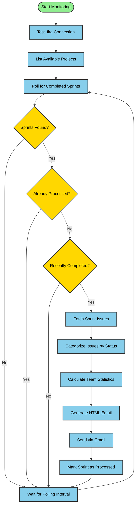

```mermaid
graph TD
    Start([Start Monitoring]):::startNode --> TestConnection[Test Jira Connection]:::processNode
    TestConnection --> ListProjects[List Available Projects]:::processNode
    ListProjects --> Poll[Poll for Completed Sprints]:::processNode
    Poll --> CheckSprints{Sprints Found?}:::decisionNode
    CheckSprints -->|No| Wait[Wait for Polling Interval]:::processNode
    CheckSprints -->|Yes| CheckProcessed{Already Processed?}:::decisionNode
    CheckProcessed -->|Yes| Wait
    CheckProcessed -->|No| CheckRecent{Recently Completed?}:::decisionNode
    CheckRecent -->|No| Wait
    CheckRecent -->|Yes| FetchIssues[Fetch Sprint Issues]:::processNode
    FetchIssues --> CategorizeIssues[Categorize Issues by Status]:::processNode
    CategorizeIssues --> CalculateStats[Calculate Team Statistics]:::processNode
    CalculateStats --> GenerateEmail[Generate HTML Email]:::processNode
    GenerateEmail --> SendEmail[Send via Gmail]:::processNode
    SendEmail --> MarkProcessed[Mark Sprint as Processed]:::processNode
    MarkProcessed --> Wait
    Wait --> Poll

    classDef startNode fill:#90EE90,stroke:#333,stroke-width:2px,color:#000
    classDef endNode fill:#FFB6C1,stroke:#333,stroke-width:2px,color:#000
    classDef processNode fill:#87CEEB,stroke:#333,stroke-width:2px,color:#000
    classDef decisionNode fill:#FFD700,stroke:#333,stroke-width:2px,color:#000
```
