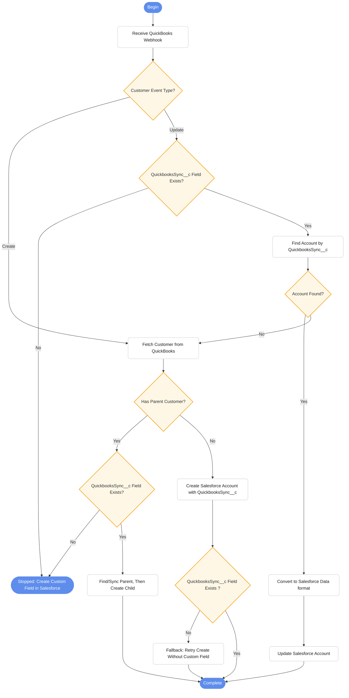

# QuickBooks to Salesforce Sync Flowchart

```mermaid
flowchart TB
    A(["Begin"]) --> B["Receive QuickBooks Webhook"]
    B --> C{"Customer Event Type?"}
    C -- Create --> D["Fetch Customer from QuickBooks"]
    C -- Update --> E{"QuickbooksSync__c Field Exists?"}
    E -- No --> X(["Stopped: Create Custom Field in Salesforce"])
    E -- Yes --> F["Find Account by QuickbooksSync__c"]
    F --> G{"Account Found?"}
    G -- Yes --> H["Convert to Salesforce Data format"]
    H --> I["Update Salesforce Account"]
    G -- No --> D
    D --> J{"Has Parent Customer?"}
    J -- Yes --> K{"QuickbooksSync__c Field Exists?"}
    K -- No --> X
    K -- Yes --> L["Find/Sync Parent, Then Create Child"]
    J -- No --> N["Create Salesforce Account with QuickbooksSync__c"]
    N --> O{"QuickbooksSync__c Field Exists ?"}
    O -- No --> P["Fallback: Retry Create Without Custom Field"]
    O -- Yes --> M(["Complete"])
    I --> M
    L --> M
    P --> M

     A:::startNode
     B:::processNode
     C:::decisionNode
     D:::processNode
     E:::decisionNode
     X:::endNode
     F:::processNode
     G:::decisionNode
     H:::processNode
     I:::processNode
     J:::decisionNode
     K:::decisionNode
     L:::processNode
     N:::processNode
     O:::decisionNode
     P:::processNode
     M:::endNode
    classDef startNode fill:#5E8DEB,stroke:#5E8DEB,color:#FFFFFF,stroke-width:1px
    classDef endNode fill:#5E8DEB,stroke:#5E8DEB,color:#FFFFFF,stroke-width:1px
    classDef processNode fill:#FFFFFF,stroke:#D9D9D9,color:#222222,stroke-width:1.5px,rx:8px,ry:8px
    classDef decisionNode fill:#FFF7E6,stroke:#F5A623,color:#333333,stroke-width:2px
```
