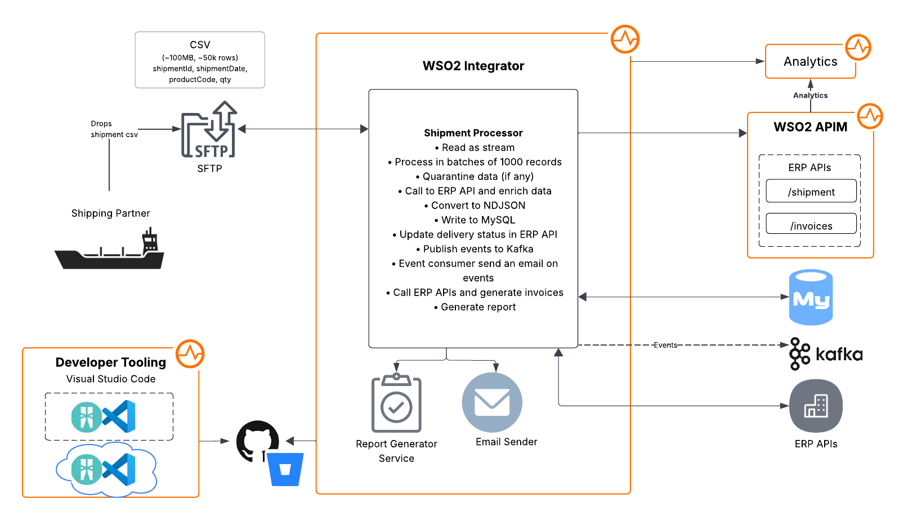
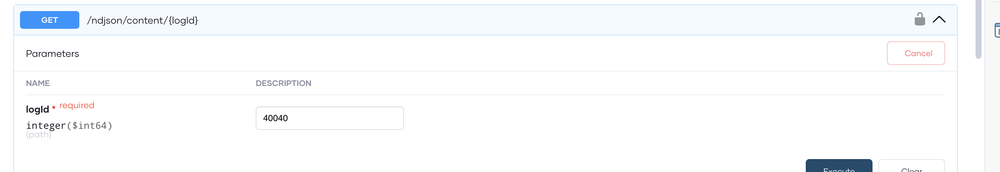
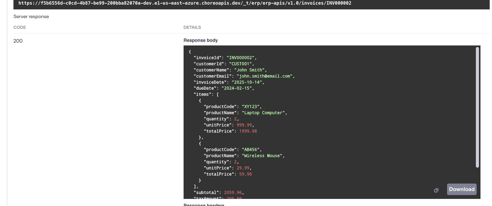
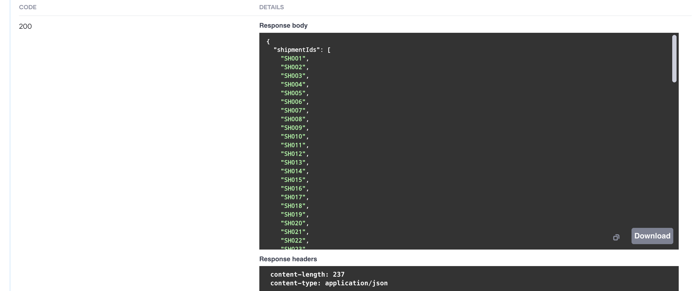

# Shipment Processing Use Case

### Overview
Following digrams depicts the overview of the shipment processing use case hosted in WSO2 platform:



**Flow**
Following diagram depicts the flow of the scenario:


### How to test the use case

**Please note**: All the services are hosted in WSO2 iPaas (Devant) and WSO2 APIM SaaS (Bijira). Please login to the platform to proceed with the next steps.

* Devant - [https://console.devant.dev](https://console.devant.dev/)
* Bijira - [https://console.bijira](https://devportal.bijira.dev/)

**Try-out Steps**
1. Add the shared CSV files(/data) to one of the following directories in the SFTP server:

Please note: Relevant credentails to access SFTP server is shared by WSO2 team seperately.

  `/csv/dev`

  `/csv/prod`

2. The file will automatically start processing.

3. Once processing is complete, the corresponding file will be moved to:

  `/processed/dev` or `/processed/prod` in SFTP location.

4. Shipment product details will be inserted into the shipment_products table.

5. NDJSON logs will be recorded in the ndjson_logs table in the relevant database.

6. You can view the results of ndjson conversions from Bijira Test Console. These are exposed under `ERP` API resources.
 Go to [https://console.bijira.](https://devportal.bijira.dev/) -> `Test` -> `OpenAPI Console`

Click Generate URL

 
 Try out 
 


7. Any quarantine records will be added to the quarantine_records table.

8. Email will be sent for each shipoments 


9. Generate customer-wise PDF reports
   /reports

10. Generate invoices : Go to `/invoices` resource endpoint and try out by adding below payload
```
{
    "customerId": "CUST001",
    "customerName": "John Smith",
    "customerEmail": "john.smith@email.com",
    "dueDate": "2024-02-15",
    "items": [
      {
        "productCode": "XY123",
        "productName": "Laptop Computer",
        "quantity": 2,
        "unitPrice": 999.99,
        "totalPrice": 1999.98
      },
      {
        "productCode": "AB456",
        "productName": "Wireless Mouse",
        "quantity": 2,
        "unitPrice": 29.99,
        "totalPrice": 59.98
      }
    ],
    "taxAmount": 205.99,
    "currency": "USD",
    "shipmentId": "SH001"
  }
```




11. You may execute /shipments/{shipment_id} to get shipment details
    
    

12. You may execute /shipments/ids to get distinct shipment ids




13. You can observe logs under Observability section

```
2025-10-16T16:22:47.642Z Application Logs v1.0 Production INFO Downloading file 250915_2k_shipments.csv to /tmp/file_processing/250915_2k_shipments.csv_proc {"module":"shashika/shipmentprocessor","correlationId":"4262b622-8052-4b7f-9a20-622136db152a"}
2025-10-16T16:22:49.968Z Application Logs v1.0 Production INFO Successfully downloaded and saved 250915_2k_shipments.csv as /tmp/file_processing/250915_2k_shipments.csv_proc {"module":"shashika/shipmentprocessor","correlationId":"4262b622-8052-4b7f-9a20-622136db152a"}
2025-10-16T16:22:49.969Z Application Logs v1.0 Production INFO Processing CSV file: 250915_2k_shipments.csv {"module":"shashika/shipmentprocessor","correlationId":"4262b622-8052-4b7f-9a20-622136db152a"}
2025-10-16T16:23:17.629Z Application Logs v1.0 Production INFO File already exists in temp directory: /tmp/file_processing/250915_2k_shipments.csv_proc {"module":"shashika/shipmentprocessor","correlationId":"71f05a02-46ce-46fe-bd66-1e6bbf1a84d6"}
2025-10-16T16:23:17.630Z Application Logs v1.0 Production INFO Processing CSV file: 250915_2k_shipments.csv {"module":"shashika/shipmentprocessor","correlationId":"71f05a02-46ce-46fe-bd66-1e6bbf1a84d6"}
2025-10-16T16:23:17.695Z Application Logs v1.0 Production INFO Enriched shipment: {shipmentId: "SH001", orderId: "ORD001", customerId: "CUST001", customerName: "Sarah Brown", status: PENDING} {"module":"shashika/shipmentprocessor","correlationId":"1ded4bfc-fad9-44f5-ac81-bbe4a2dad4df"}
2025-10-16T16:23:17.713Z Application Logs v1.0 Production INFO Enriched shipment: {shipmentId: "SH001", orderId: "ORD001", customerId: "CUST001", customerName: "Sarah Brown", status: PENDING} {"module":"shashika/shipmentprocessor","correlationId":"6e59d19d-9381-48f4-876f-bcc65f91d748"}
```

```
2025-10-16T16:27:54.018Z Application Logs v1.0 Production INFO Processed 1000/1000 records in batch {"module":"shashika/shipmentprocessor","correlationId":"ea532551-450a-49d4-959c-0fc364cce0d9"}
2025-10-16T16:27:54.018Z Application Logs v1.0 Production INFO Starting async batch insert of 1000 enriched shipments {"module":"shashika/shipmentprocessor"}
2025-10-16T16:27:54.023Z Application Logs v1.0 Production INFO Database batch progress: 1000/1000 records processed {"module":"shashika/shipmentprocessor"}
2025-10-16T16:27:54.023Z Application Logs v1.0 Production INFO Batch insert completed: 1000 records inserted, 0 errors {"module":"shashika/shipmentprocessor"}
2025-10-16T16:27:54.073Z Application Logs v1.0 Production INFO CSV file processing completed - no more data rows {"module":"shashika/shipmentprocessor","correlationId":"ea532551-450a-49d4-959c-0fc364cce0d9"}
```

```
2025-10-16T16:27:58.255Z Application Logs v1.0 Production INFO CSV processing completed: 250915_2k_shipments.csv, batches: 3, total: 2025 {"module":"shashika/shipmentprocessor","correlationId":"ea532551-450a-49d4-959c-0fc364cce0d9"}
2025-10-16T16:27:58.258Z Application Logs v1.0 Production INFO File processing completed: 250915_2k_shipments.csv, total: 2025, successful: 2025, failed: 0, quarantined: 0, enriched: 2025, ndjson files: 3, db inserted: 2025 {"module":"shashika/shipmentprocessor","correlationId":"ea532551-450a-49d4-959c-0fc364cce0d9"}


