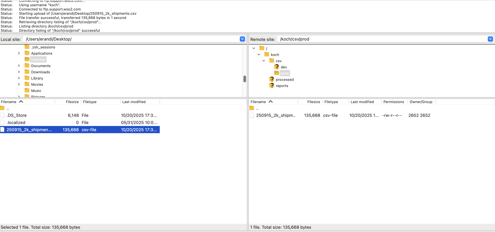
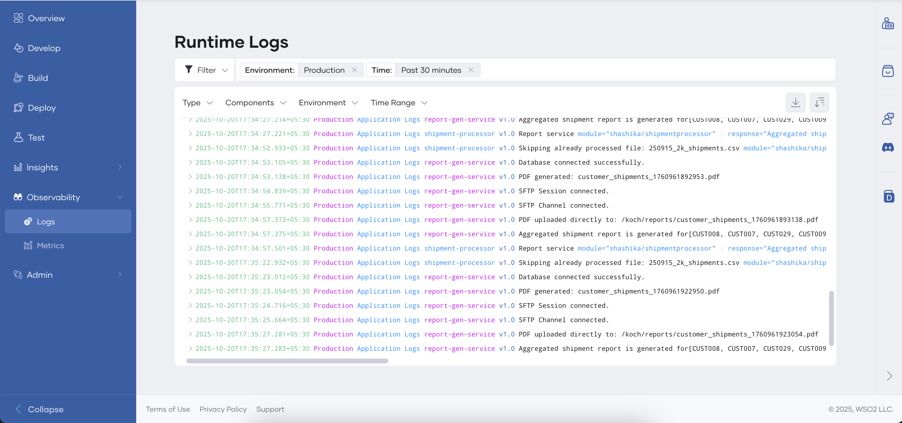
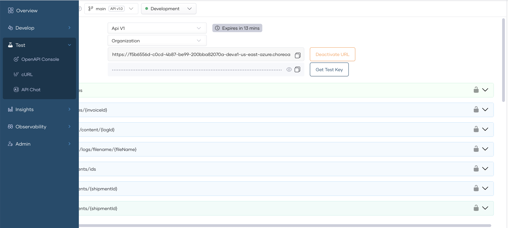
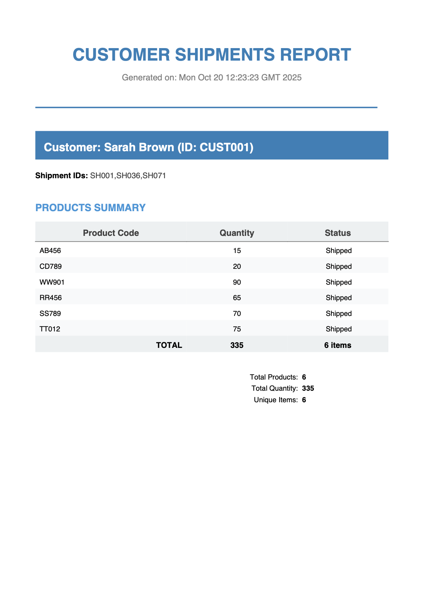
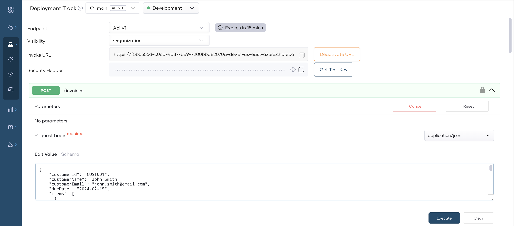

# Shipment Processing Use Case

## Overview
Following digrams depicts the overview of the shipment processing use case hosted in WSO2 platform (Devant and Bijira):


## Flow

Following diagram depicts the flow of the scenario:


## How to run and test the use case

**Please note**: All the services are hosted in WSO2 iPaas (Devant) and WSO2 APIM SaaS (Bijira). Please login to the platforms to proceed with the next steps.

* Devant - [https://console.devant.dev](https://console.devant.dev/)
* Bijira - [https://console.bijira](https://devportal.bijira.dev/)
* Bijira DevPortal - [https://devportal.bijira.dev](https://devportal.bijira.dev/kochdemo/views/default)

### Try out steps

**Step 01**

**SFTP access**

You can use a tool such as `FileZilla` to connect to the remote SFTP server and upload the sample CSV file for processing. 

**Please note** that relevant credentails to access SFTP server was shared by WSO2 team seperately.

* `250915_2k_shipments.csv` file contains set of sample data
* `QR250901_shipments.csv` file contains set of qurantine data

Add the sample CSV file in this repo location `integration-samples/ballerina-integrator/shipment-processor/data/<sample-csv>` to the following directory in the SFTP server: 
`/csv/prod`



**Step 02**

The file will be automatically processed. Login to Devant under your organization and you will be able to observe logs as mentioned below:
`Shipment Processor` Project -> `Observability` -> `Logs`



**Starting logs to be observed:**
```
2025-10-16T16:22:47.642Z Application Logs v1.0 Production INFO Downloading file 250915_2k_shipments.csv to /tmp/file_processing/250915_2k_shipments.csv_proc {"module":"shashika/shipmentprocessor","correlationId":"4262b622-8052-4b7f-9a20-622136db152a"}
2025-10-16T16:22:49.968Z Application Logs v1.0 Production INFO Successfully downloaded and saved 250915_2k_shipments.csv as /tmp/file_processing/250915_2k_shipments.csv_proc {"module":"shashika/shipmentprocessor","correlationId":"4262b622-8052-4b7f-9a20-622136db152a"}
2025-10-16T16:22:49.969Z Application Logs v1.0 Production INFO Processing CSV file: 250915_2k_shipments.csv {"module":"shashika/shipmentprocessor","correlationId":"4262b622-8052-4b7f-9a20-622136db152a"}
2025-10-16T16:23:17.629Z Application Logs v1.0 Production INFO File already exists in temp directory: /tmp/file_processing/250915_2k_shipments.csv_proc {"module":"shashika/shipmentprocessor","correlationId":"71f05a02-46ce-46fe-bd66-1e6bbf1a84d6"}
2025-10-16T16:23:17.630Z Application Logs v1.0 Production INFO Processing CSV file: 250915_2k_shipments.csv {"module":"shashika/shipmentprocessor","correlationId":"71f05a02-46ce-46fe-bd66-1e6bbf1a84d6"}
2025-10-16T16:23:17.695Z Application Logs v1.0 Production INFO Enriched shipment: {shipmentId: "SH001", orderId: "ORD001", customerId: "CUST001", customerName: "Sarah Brown", status: PENDING} {"module":"shashika/shipmentprocessor","correlationId":"1ded4bfc-fad9-44f5-ac81-bbe4a2dad4df"}
2025-10-16T16:23:17.713Z Application Logs v1.0 Production INFO Enriched shipment: {shipmentId: "SH001", orderId: "ORD001", customerId: "CUST001", customerName: "Sarah Brown", status: PENDING} {"module":"shashika/shipmentprocessor","correlationId":"6e59d19d-9381-48f4-876f-bcc65f91d748"}
```

**Step 03**

Once processing is done, the corresponding file will be moved to:

`/processed/prod` in SFTP location.

**Completion logs to be observed:**
```
2025-10-16T16:27:54.018Z Application Logs v1.0 Production INFO Processed 1000/1000 records in batch {"module":"shashika/shipmentprocessor","correlationId":"ea532551-450a-49d4-959c-0fc364cce0d9"}
2025-10-16T16:27:54.018Z Application Logs v1.0 Production INFO Starting async batch insert of 1000 enriched shipments {"module":"shashika/shipmentprocessor"}
2025-10-16T16:27:54.023Z Application Logs v1.0 Production INFO Database batch progress: 1000/1000 records processed {"module":"shashika/shipmentprocessor"}
2025-10-16T16:27:54.023Z Application Logs v1.0 Production INFO Batch insert completed: 1000 records inserted, 0 errors {"module":"shashika/shipmentprocessor"}
2025-10-16T16:27:54.073Z Application Logs v1.0 Production INFO CSV file processing completed - no more data rows {"module":"shashika/shipmentprocessor","correlationId":"ea532551-450a-49d4-959c-0fc364cce0d9"}
```

```
2025-10-16T16:27:58.255Z Application Logs v1.0 Production INFO CSV processing completed: 250915_2k_shipments.csv, batches: 3, total: 2025 {"module":"shashika/shipmentprocessor","correlationId":"ea532551-450a-49d4-959c-0fc364cce0d9"}
2025-10-16T16:27:58.258Z Application Logs v1.0 Production INFO File processing completed: 250915_2k_shipments.csv, total: 2025, successful: 2025, failed: 0, quarantined: 0, enriched: 2025, ndjson files: 3, db inserted: 2025 {"module":"shashika/shipmentprocessor","correlationId":"ea532551-450a-49d4-959c-0fc364cce0d9"}
```

**Step 04**

Shipment product details will be inserted into the database (`shipment_products` table).

**Step 05**

NDJSON records also will be recorded in the database (`ndjson_logs` table).

**Step 06**

You can view the results of ndjson conversions from Bijira Test Console. These are exposed under `ERP` API resources.
 Go to your organization in [https://console.bijira.](https://devportal.bijira.dev/) -> `ERP` project -> `ERP` API -> `Test` -> `OpenAPI Console`

Click Generate URL

* 


Try out relevant endpoints via built-in OpenAPI Console as follows:

* 
 

 Try out 
* 

* 

**Step 07 (Optional)**

Quarantine records will be added to the `quarantine_records` table in the database (if any). This can be demonstrated with the `QR250901_shipments.csv` file.

**Step 08**

Email will be sent for each shipment for a pre-configured set of users.


**Step 09**

Generated PDF reports can be found in the following SFTP location:
`/reports`

Sample report will look like in the below image:



**Step 10**

Test invoice generation by invoking the ERP API endpoint via Bijira OpenAPI Console as follows: 



Sample payload for `/invoices` resource endpoint.
```
{
    "customerId": "CUST001",
    "customerName": "John Smith",
    "customerEmail": "john.smith@email.com",
    "dueDate": "2024-02-15",
    "items": [
      {
        "productCode": "XY123",
        "productName": "Laptop Computer",
        "quantity": 2,
        "unitPrice": 999.99,
        "totalPrice": 1999.98
      },
      {
        "productCode": "AB456",
        "productName": "Wireless Mouse",
        "quantity": 2,
        "unitPrice": 29.99,
        "totalPrice": 59.98
      }
    ],
    "taxAmount": 205.99,
    "currency": "USD",
    "shipmentId": "SH001"
  }
```

Responses:


**Step 11**

You may execute `/shipments/{shipment_id}` to get shipment details


**Step 12**

You may execute `/shipments/ids` to get distinct shipment ids


**Step 13**

You may log into Bijira DevPortal and try out the API discovery and invocations as guided in the official documentation here:

* API Discovery - https://wso2.com/bijira/docs/devportal/discover-apis/api-search/
* Consume APIs - https://wso2.com/bijira/docs/devportal/consuming-services/consume-an-api-secured-with-oauth2/
