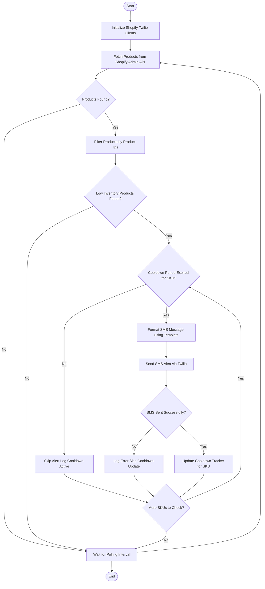

```mermaid
flowchart TD
    S([Start]):::startNode
    S --> INIT[Initialize Shopify Twilio Clients]:::processNode
    INIT --> FETCH[Fetch Products from Shopify Admin API]:::processNode
    FETCH --> PFOUND{Products Found?}:::decisionNode
    PFOUND -- No --> WAIT[Wait for Polling Interval]:::processNode
    PFOUND -- Yes --> FILTER[Filter Products by Product IDs]:::processNode
    FILTER --> PCHECK{Low Inventory Products Found?}:::decisionNode
    PCHECK -- No --> WAIT
    PCHECK -- Yes --> COOLDOWN{Cooldown Period Expired for SKU?}:::decisionNode
    COOLDOWN -- No --> SKIP[Skip Alert Log Cooldown Active]:::processNode
    SKIP --> MORESKU{More SKUs to Check?}:::decisionNode
    COOLDOWN -- Yes --> FORMAT[Format SMS Message Using Template]:::processNode
    FORMAT --> SEND[Send SMS Alert via Twilio]:::processNode
    SEND --> SENT{SMS Sent Successfully?}:::decisionNode
    SENT -- No --> LOGERR[Log Error Skip Cooldown Update]:::processNode
    LOGERR --> MORESKU
    SENT -- Yes --> UPDATE[Update Cooldown Tracker for SKU]:::processNode
    UPDATE --> MORESKU
    MORESKU -- Yes --> COOLDOWN
    MORESKU -- No --> WAIT
    WAIT --> FETCH
    WAIT --> E([End]):::endNode
```
