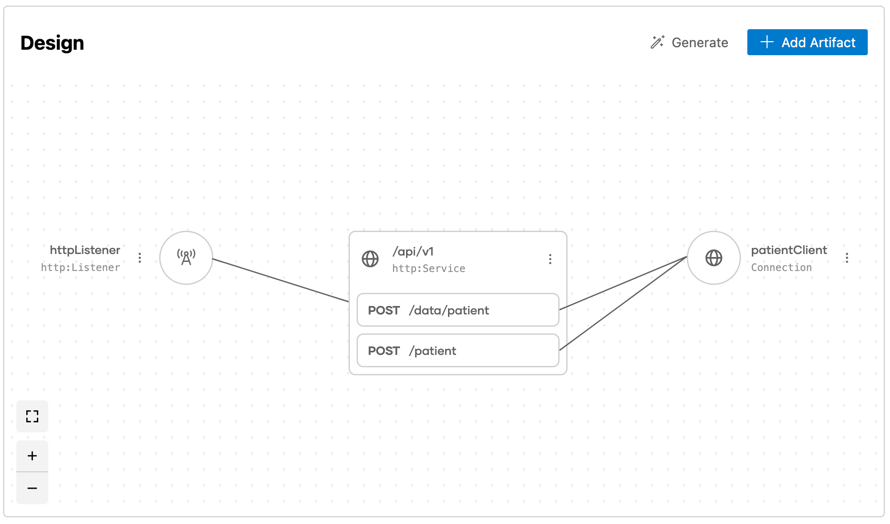
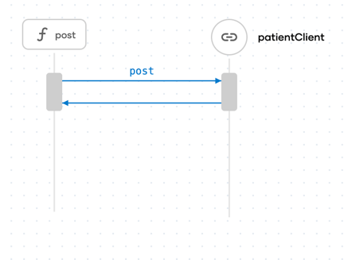

## Integration with Format Indicator Pattern Using WSO2 Integrator:BI

### Overview

The **Format Indicator**  will identify the message format based on the version or structure and process it. 
This integration is built using **WSO2 Integrator:BI** to showcase the ease of implementing such patterns within a low-code integration environment.

For more detailed information on the **Format Indicator** pattern, visit the [Format Indicator documentation](https://www.enterpriseintegrationpatterns.com/patterns/messaging/FormatIndicator.html).

## Design View

The **Design View** visualizes the overall system structure.



## Integration Flow
<div style="display: flex; justify-content: space-between;">
  
  
</div>

## Sequence Diagram
<div style="display: flex; justify-content: space-between;">
  
  
</div>

## Steps to Open with WSO2 Integrator:BI

Follow these steps to open the project and start working with the **Format Indicator** integration using **WSO2 Integrator:BI** in **VS Code**:

1. Clone the repository to your local machine by running the following command.
   ```bash
   git clone https://github.com/wso2/integration-samples.git
   ```
2. Open VS Code.
3. Once VS Code is opened, go to `File > Open Folder...`.
4. Navigate to the directory where you cloned the repository.
5. Select the project folder and open it.
