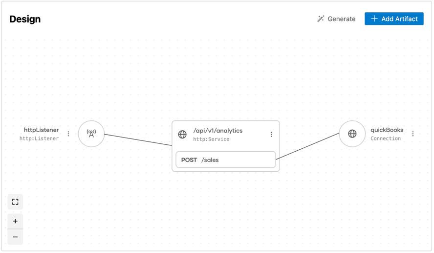

## Integration with Message Translator Pattern Using WSO2 Integrator:BI

### Overview

The **Message Translator** pattern transforms messages from one structure to another. It is used when a message must be converted between different formats or models as it moves between systems or components. This pattern helps in achieving interoperability between systems that may use different message formats.
This integration is built using **WSO2 Integrator:BI** to showcase the ease of implementing such patterns within a low-code integration environment.

For more detailed information on the **Message Translator** pattern, visit the [Message Translator documentation](https://www.enterpriseintegrationpatterns.com/patterns/messaging/MessageTranslator.html).

## Design View

The **Design View** visualizes the overall system structure. It shows how different components (filters) are connected through pipes, demonstrating the data flow and interaction between the independent processing steps in the pipeline.



## Integration Flow


## Sequence Diagram


## Steps to Open with WSO2 Integrator:BI

Follow these steps to open the project and start working with the **Message Translator** integration using **WSO2 Integrator:BI** in **VS Code**:

1. Clone the repository to your local machine by running the following command.
   ```bash
   git clone https://github.com/wso2/integration-samples.git
   ```
2. Open VS Code.
3. Once VS Code is opened, go to `File > Open Folder...`.
4. Navigate to the directory where you cloned the repository.
5. Select the project folder and open it.
