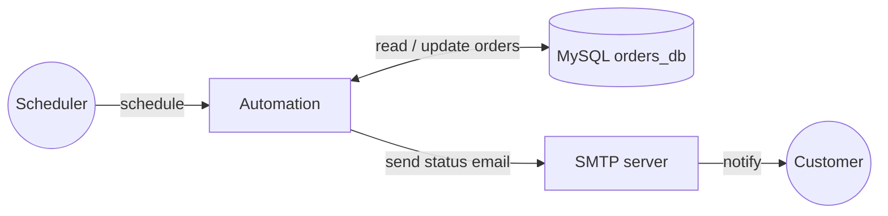

# Order Management Automation

A scheduled automation that processes newly placed orders. On each run it reads every order still in the `PLACED` state from a MySQL `orders_db`, emails the customer that their order is being handled, advances the order to `PROCESSING`, and logs a summary. When nothing is waiting, the run exits early.

## How it works



1. Read the `orders` table for rows whose status is still `PLACED`.
2. If nothing is waiting, log a note and stop.
3. Otherwise, for each waiting order, email the customer and update the order to `PROCESSING`.
4. Log a one-line summary of how much work the run did.

## Prerequisites

- MySQL Server running on `localhost:3306`, with the sample `orders_db` database seeded using [the setup script](#database-setup).
- An SMTP-enabled email account to send the customer notifications.

## Database setup

```sql
CREATE DATABASE IF NOT EXISTS orders_db;
CREATE USER IF NOT EXISTS 'orders_user'@'localhost' IDENTIFIED BY 'orders_pass';
GRANT SELECT, UPDATE ON orders_db.* TO 'orders_user'@'localhost';
FLUSH PRIVILEGES;

USE orders_db;

CREATE TABLE customers (
    customer_id VARCHAR(20) PRIMARY KEY,
    name        VARCHAR(100),
    email       VARCHAR(100),
    address     VARCHAR(255)
);

CREATE TABLE products (
    product_id   VARCHAR(20) PRIMARY KEY,
    product_name VARCHAR(100),
    category     VARCHAR(50),
    price        DECIMAL(10,2)
);

CREATE TABLE orders (
    order_id    VARCHAR(20) PRIMARY KEY,
    customer_id VARCHAR(20),
    product_id  VARCHAR(20),
    amount      DECIMAL(10,2),
    status      VARCHAR(20) DEFAULT 'PLACED',
    placed_at   TIMESTAMP DEFAULT CURRENT_TIMESTAMP,
    FOREIGN KEY (customer_id) REFERENCES customers(customer_id),
    FOREIGN KEY (product_id)  REFERENCES products(product_id)
);

INSERT INTO customers VALUES
    ('CUST-001', 'Ada Lovelace',   'ada@example.com',   '10 Analytical Way'),
    ('CUST-002', 'Alan Turing',    'alan@example.com',  '24 Enigma Street'),
    ('CUST-003', 'Grace Hopper',   'grace@example.com', '7 Compiler Lane'),
    ('CUST-004', 'Edsger Dijkstra','ed@example.com',    '3 Shortest Path');

INSERT INTO products VALUES
    ('PROD-001', 'Mechanical Keyboard', 'Peripherals', 79.99),
    ('PROD-002', 'USB-C Hub',           'Accessories', 34.50),
    ('PROD-003', 'Standing Desk',       'Furniture',   129.00),
    ('PROD-004', 'Desk Lamp',           'Lighting',    49.99);

INSERT INTO orders (order_id, customer_id, product_id, amount, status) VALUES
    ('ORD-001', 'CUST-001', 'PROD-001', 79.99,  'PLACED'),
    ('ORD-002', 'CUST-002', 'PROD-002', 34.50,  'PLACED'),
    ('ORD-003', 'CUST-003', 'PROD-003', 129.00, 'PROCESSING'),
    ('ORD-004', 'CUST-004', 'PROD-004', 49.99,  'PROCESSING');
```

## Configuration

Provide the database password and SMTP details in `Config.toml`:

```toml
ordersDBPassword = "orders_pass"
emailHost = "smtp.example.com"
emailUserName = "orders@example.com"
emailPassword = "<your-smtp-password>"
emailPort = 465
```

## Run

Generate the database client and run the automation:

```bash
bal persist generate
bal run
```

On the first run, the two `PLACED` orders advance to `PROCESSING` and their customers are emailed. A second run finds nothing waiting and exits with `No new orders to process.`

To reset and run again, move the orders back:

```sql
UPDATE orders_db.orders SET status = 'PLACED' WHERE order_id IN ('ORD-001', 'ORD-002');
```
